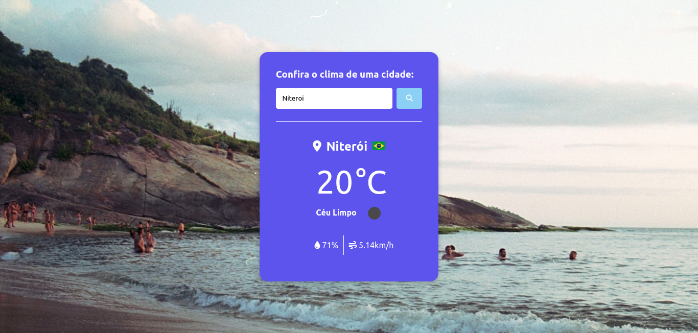

## Table of contents

- [Overview](#overview)
  - [O Desafio](#the-challenge)
  - [Screenshot](#Print)
  - [Links](#links)
- [My process](#my-process)
  - [Built with](#built-with)
  - [What I learned](#what-i-learned)
  - [Continued development](#continued-development)
  - [Useful resources](#useful-resources)
- [Author](#author)
- 

## Overview

### O desafio

- Construir uma página web que forneça dados do tempo em alguma cidade através do consumo de uma API

### Print

### Links

- Live Site URL: [Weather App](https://patkat20.github.io/WeatherApp/)

## Meu Processo

### Construido com:

- Semantic HTML5 markup
- CSS custom properties
- Flexbox
- [JavaScript](https://www.ecma-international.org/publications-and-standards/standards/ecma-262/) - JS Vanilla

### O que eu aprendi

Nesse projeto pude aprender conceitos básicos de promisses, async/await e consumo de APIs

### Desenvolvimento

Com esse projeto finalizado fico mais empolgado para aprender mais sobre consumo de APIs e de iniciar
novos projetos com outras APIs

## Author

- Website - [PatKat20](https://patkat20.github.io/)
- Instagram - [@patric_ddeus](https://www.instagram.com/patric_ddeus/)
